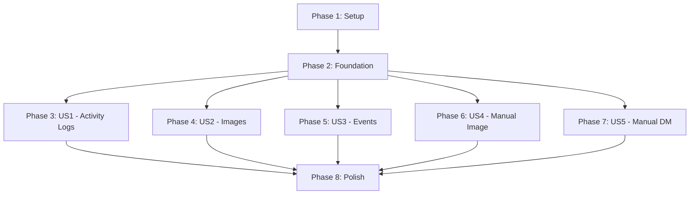

# Tasks: Admin Web Dashboard for Lukas the Bear

**Input**: Design documents from `/specs/002-web-dashboard/`
**Prerequisites**: plan.md, spec.md, research.md, data-model.md, contracts/openapi.yaml

**Tests**: Per constitution principle 3 (Pragmatic Testing 80/20), tests focus on critical user journeys and API contracts. Not targeting 100% coverage.

**Organization**: Tasks are grouped by user story to enable independent implementation and testing of each story.

## Format: `- [ ] [ID] [P?] [Story?] Description`

- **[P]**: Can run in parallel (different files, no dependencies)
- **[Story]**: Which user story this task belongs to (US1-US5)
- All task descriptions include exact file paths

---

## Phase 1: Setup (Shared Infrastructure)

**Purpose**: Project initialization, Docker configuration, and basic project structure

- [X] T001 Create dashboard directory structure (dashboard/backend, dashboard/frontend) per plan.md project structure
- [X] T002 [P] Create dashboard/backend/requirements.txt with Flask 3.0+, Flask-CORS, Flask-Session, SQLAlchemy, python-dotenv, pytest, pytest-flask
- [X] T003 [P] Create dashboard/frontend/package.json with Vue 3, Vue Router, Axios, Vite, Vitest dependencies
- [X] T004 [P] Create dashboard/Dockerfile.dashboard with multi-stage build (Node.js for frontend build, Python 3.11-alpine for runtime)
- [X] T005 [P] Update docker-compose.dev.yml to add dashboard service (port 8080, volumes for data/, sessions/, thumbnails/)
- [X] T006 [P] Update docker-compose.yml (production) to add dashboard service with same configuration
- [X] T007 [P] Create dashboard/README.md with quickstart instructions from quickstart.md
- [X] T008 [P] Create dashboard/.gitignore for Python (__pycache__, *.pyc) and Node (node_modules/, dist/) artifacts
- [X] T009 Update .env.example to add DASHBOARD_ADMIN_PASSWORD with secure password guidelines (min 12 chars)

---

## Phase 2: Foundational (Blocking Prerequisites)

**Purpose**: Core infrastructure that MUST be complete before ANY user story can be implemented

**⚠️ CRITICAL**: No user story work can begin until this phase is complete

### Backend Foundation

- [X] T010 Create dashboard/backend/config.py to load environment variables (DASHBOARD_ADMIN_PASSWORD, DATABASE_PATH, FLASK_ENV, SESSION_DIR)
- [X] T011 Create dashboard/backend/app.py with Flask application factory, CORS configuration, session setup (Flask-Session filesystem backend pointing to SESSION_DIR from config.py), and startup checks (verify SESSION_DIR exists and is writable, create if missing with proper permissions)
- [X] T012 Create dashboard/backend/services/database.py with SQLAlchemy engine setup for shared bot database (read-only mode for most queries, WAL mode)
- [X] T013 Create dashboard/backend/models/__init__.py to import existing models from src/models/ (Message, GeneratedImage, ScheduledTask, TeamMember, Conversation)
- [X] T014 Create dashboard/backend/auth.py with authentication middleware (check session) and require_auth decorator
- [X] T015 Create dashboard/backend/routes/__init__.py to register all route blueprints
- [X] T016 [P] Create dashboard/backend/services/__init__.py as package initializer
- [X] T017 [P] Create dashboard/backend/services/query_builder.py with reusable pagination and filtering utilities
- [X] T017.5 [P] Create dashboard/backend/utils/errors.py with error translation functions (map SQLAlchemy exceptions to user-friendly messages, map HTTP status codes to readable descriptions, ErrorResponse class)

### Frontend Foundation

- [X] T018 Create dashboard/frontend/vite.config.js with proxy to backend API (http://localhost:5000/api) for development
- [X] T019 Create dashboard/frontend/index.html with meta tags, viewport settings, and div#app mount point
- [X] T020 Create dashboard/frontend/src/main.js to initialize Vue 3 app with router
- [X] T021 Create dashboard/frontend/src/App.vue with root component (router-view, global error handling)
- [X] T022 Create dashboard/frontend/src/router/index.js with Vue Router configuration (routes: /, /dashboard, /activity, /images, /events, /controls)
- [X] T023 Create dashboard/frontend/src/services/api.js with Axios instance, base URL configuration, and auth interceptor (include credentials)
- [X] T024 [P] Create dashboard/frontend/src/utils/date.js with date formatting utilities (ISO to local, relative time)
- [X] T025 [P] Create dashboard/frontend/src/utils/filters.js with text search and filter utilities
- [X] T026 [P] Create dashboard/frontend/public/favicon.ico and other static assets

### Testing Infrastructure

- [X] T027 Create dashboard/backend/tests/conftest.py with pytest fixtures (app, client, mock database session)
- [X] T028 [P] Create dashboard/frontend/vitest.config.js for unit testing configuration
- [X] T029 [P] Create dashboard/frontend/playwright.config.js for E2E testing (critical flows only per constitution)

**Checkpoint**: Foundation ready - user story implementation can now begin in parallel

---

## Phase 3: User Story 1 - View Activity Logs (Priority: P1) 🎯 MVP

**Goal**: Display chronological list of bot messages with filtering by date range, recipient, and message type. Includes message detail view and automatic polling updates.

**Independent Test**: Login → Activity Log tab → See messages list → Click message → See details → Apply date filter → Verify filtered results → Wait 10s → See new messages appear

### Backend API for Activity Logs

- [X] T030 [US1] Create dashboard/backend/routes/auth.py with POST /api/auth/login endpoint (verify password, create session, return success/failure)
- [X] T031 [US1] Add POST /api/auth/logout endpoint to dashboard/backend/routes/auth.py (clear session, return success)
- [X] T032 [US1] Add GET /api/auth/session endpoint to dashboard/backend/routes/auth.py (check authentication status)
- [X] T033 [US1] Create dashboard/backend/routes/activity.py with GET /api/activity endpoint (paginated list with filters: page, limit, start_date, end_date, recipient, channel_type) - uses paginate() from query_builder.py (T035.5)
- [X] T034 [US1] Add GET /api/activity/<id> endpoint to dashboard/backend/routes/activity.py (full message details with conversation context)
- [X] T035 [US1] Implement activity log query logic in dashboard/backend/services/query_builder.py (JOIN messages, conversations, team_members tables with filters and pagination)
- [X] T035.5 [P] [US1] Implement pagination utilities in dashboard/backend/services/query_builder.py (add paginate() function with LIMIT/OFFSET, calculate total_pages, return metadata dict with page, total, pages, limit)
- [X] T036 [US1] Add error handling in dashboard/backend/routes/activity.py (404 for not found, 500 for database errors, return user-friendly messages)

### Frontend UI for Activity Logs

- [X] T037 [US1] Create dashboard/frontend/src/views/Login.vue with password form, submit handler, error display, and redirect to dashboard on success
- [X] T038 [US1] Create dashboard/frontend/src/services/auth.js with login(), logout(), checkSession() API calls using api.js
- [X] T039 [US1] Create dashboard/frontend/src/views/Dashboard.vue with navigation tabs (Activity, Images, Events, Controls) and router-view for sub-routes
- [X] T040 [US1] Create dashboard/frontend/src/services/activity.js with getActivityLog(params), getActivityDetail(id) API calls
- [X] T041 [US1] Create dashboard/frontend/src/views/ActivityLog.vue with table display, date range filters, recipient filter, pagination controls
- [X] T042 [US1] Create dashboard/frontend/src/components/ActivityTable.vue with message rows (timestamp, recipient, channel type, message preview, click to expand)
- [X] T043 [US1] Add message detail modal to dashboard/frontend/src/components/ActivityTable.vue (full content, conversation context, tool invocations)
- [X] T044 [US1] Create dashboard/frontend/src/composables/usePolling.js with polling logic (fetch every 5-10s, pause when page hidden using Page Visibility API)
- [X] T045 [US1] Create dashboard/frontend/src/composables/usePagination.js with pagination state management (currentPage, totalPages, pageSize)
- [X] T046 [US1] Integrate usePolling in dashboard/frontend/src/views/ActivityLog.vue to auto-refresh activity log (respect user filters, maintain scroll position)
- [X] T047 [US1] Add loading states and error handling to dashboard/frontend/src/views/ActivityLog.vue (spinner, error messages, retry button)
- [X] T048 [US1] Create dashboard/frontend/src/components/Pagination.vue reusable component (prev/next buttons, page numbers, items per page selector)

### Testing for US1

- [ ] T049 [US1] Create dashboard/backend/tests/test_auth.py with tests for login (success, wrong password, missing env var), logout, session check
- [ ] T050 [US1] Create dashboard/backend/tests/test_activity_api.py with tests for GET /api/activity (pagination, filters, empty results, auth required)
- [ ] T051 [US1] Create dashboard/frontend/tests/e2e/login-and-view-activity.spec.js with Playwright test (login → navigate → verify messages displayed)

**Checkpoint**: At this point, admins can log in and view/filter activity logs with auto-refresh. This is the MVP.

---

## Phase 4: User Story 2 - View Generated Images History (Priority: P2)

**Goal**: Display gallery of generated images with thumbnails, filtering by date/status, and detailed view with generation metadata and error messages.

**Independent Test**: Login → Images tab → See gallery → Filter by failed status → Click image → See full details with prompt and error message → Verify thumbnail loads quickly

### Backend API for Images

- [X] T052 [P] [US2] Create dashboard/backend/routes/images.py with GET /api/images endpoint (paginated list with filters: page, limit, start_date, end_date, status)
- [X] T053 [P] [US2] Add GET /api/images/<id> endpoint to dashboard/backend/routes/images.py (full image details including prompt, status, channel, error_message)
- [X] T054 [US2] Add GET /api/images/<id>/thumbnail endpoint to dashboard/backend/routes/images.py (generate thumbnail on-demand using Pillow, cache to filesystem)
- [X] T055 [US2] Implement image query logic in dashboard/backend/services/query_builder.py (query generated_images table with filters and pagination)
- [X] T056 [US2] Create thumbnail generation utility in dashboard/backend/services/thumbnail_generator.py (300x300px, JPEG quality 85, cache to thumbnails/ directory)
- [X] T057 [US2] Add error handling in dashboard/backend/routes/images.py (404 for not found, 500 for generation errors, cache headers for thumbnails)

### Frontend UI for Images

- [X] T058 [P] [US2] Create dashboard/frontend/src/services/images.js with getImages(params), getImageDetail(id), getThumbnailUrl(id) API calls
- [X] T059 [US2] Create dashboard/frontend/src/views/ImagesGallery.vue with grid layout, date/status filters, pagination
- [X] T060 [US2] Create dashboard/frontend/src/components/ImageCard.vue with thumbnail display, overlay with prompt preview, status badge (posted/failed/pending)
- [X] T061 [US2] Add image detail modal to dashboard/frontend/src/views/ImagesGallery.vue (full image, prompt, timestamp, channel, status, error message if failed)
- [X] T062 [US2] Add loading states for thumbnails in dashboard/frontend/src/components/ImageCard.vue (skeleton loading, fallback for missing images)
- [X] T063 [US2] Add error handling to dashboard/frontend/src/views/ImagesGallery.vue (display errors, retry button, empty state for no images)

### Testing for US2

- [ ] T064 [US2] Create dashboard/backend/tests/test_images_api.py with tests for GET /api/images (pagination, filters, auth required), GET /api/images/<id> (details, 404), GET thumbnail (generation, caching)
- [ ] T065 [US2] Create dashboard/frontend/tests/unit/ImageCard.spec.js with Vitest tests for thumbnail loading, status badges, click handlers

**Checkpoint**: At this point, admins can view and review all generated images with metadata. User Stories 1 AND 2 both work independently.

---

## Phase 5: User Story 3 - View Scheduled Events (Priority: P3)

**Goal**: Display upcoming scheduled events and completed event history with sorting by scheduled time. Show event details (type, target, status, execution time).

**Independent Test**: Login → Events tab → See "Upcoming Events" and "Completed Events" sections → Verify upcoming shows pending tasks sorted by time → Verify completed shows execution timestamps and statuses

### Backend API for Events

- [X] T066 [P] [US3] Create dashboard/backend/routes/events.py with GET /api/events/upcoming endpoint (list pending tasks sorted by scheduled_time ASC)
- [X] T067 [P] [US3] Add GET /api/events/completed endpoint to dashboard/backend/routes/events.py (paginated list of completed/failed/cancelled tasks, sorted by executed_at DESC)
- [X] T068 [US3] Implement events query logic in dashboard/backend/services/query_builder.py (query scheduled_tasks table with status filters)
- [X] T069 [US3] Add error handling in dashboard/backend/routes/events.py (500 for database errors, user-friendly messages)

### Frontend UI for Events

- [X] T070 [P] [US3] Create dashboard/frontend/src/services/events.js with getUpcomingEvents(limit), getCompletedEvents(page, limit) API calls
- [X] T071 [US3] Create dashboard/frontend/src/views/ScheduledEvents.vue with two sections (Upcoming, Completed) and pagination for completed events
- [X] T072 [US3] Create dashboard/frontend/src/components/EventTimeline.vue for upcoming events (timeline layout, event type icons, scheduled time, target info)
- [X] T073 [US3] Add completed events table to dashboard/frontend/src/views/ScheduledEvents.vue (event type, scheduled time, executed time, status, error message if failed)
- [X] T074 [US3] Add sorting controls to dashboard/frontend/src/views/ScheduledEvents.vue (chronological/reverse for completed events)
- [X] T075 [US3] Add loading states and error handling to dashboard/frontend/src/views/ScheduledEvents.vue (spinner, error messages, empty states)

### Testing for US3

- [ ] T076 [US3] Create dashboard/backend/tests/test_events_api.py with tests for GET /api/events/upcoming (sorting, auth required), GET /api/events/completed (pagination, status filtering)

**Checkpoint**: At this point, admins can view bot's schedule and verify past actions. All three monitoring features (US1-3) are functional.

---

## Phase 6: User Story 4 - Manually Trigger Image Generation (Priority: P4)

**Goal**: Provide manual control to trigger image generation with optional theme and target channel. Show feedback on action status and log to scheduled_tasks table.

**Independent Test**: Login → Manual Controls tab → Click "Generate Image" → Optionally specify theme/channel → Verify success message → Check Activity Log for completion → Verify logged to scheduled_tasks

### Backend API for Manual Image Control

- [X] T077 [P] [US4] Create dashboard/backend/services/bot_invoker.py with invoke_image_generation(theme, channel_id) method to call src.services.ImageService
- [X] T078 [US4] Create dashboard/backend/routes/controls.py with POST /api/controls/generate-image endpoint (accept theme, channel_id in body, invoke bot service, log to scheduled_tasks)
- [X] T079 [US4] Implement audit logging in dashboard/backend/routes/controls.py (INSERT to scheduled_tasks with task_type='manual_image', metadata JSON with theme/channel/source='dashboard')
- [X] T080 [US4] Add error handling in dashboard/backend/routes/controls.py (catch bot service errors, OpenAI API errors, return user-friendly messages with 500 status)
- [X] T081 [US4] Add rate limiting check in dashboard/backend/routes/controls.py (max 10 image generations per hour per session, return 429 if exceeded)

### Frontend UI for Manual Image Control

- [X] T082 [P] [US4] Create dashboard/frontend/src/services/controls.js with generateImage(theme, channelId) API call
- [X] T083 [US4] Create dashboard/frontend/src/views/ManualControls.vue with two control panels (Generate Image, Send DM)
- [X] T084 [US4] Create dashboard/frontend/src/components/ControlPanel.vue for image generation (theme text input, channel selector dropdown, "Generate Image" button, feedback display)
- [X] T085 [US4] Add channel selection to dashboard/frontend/src/components/ControlPanel.vue (fetch from bot config or hardcode common channels, optional field)
- [X] T086 [US4] Add success/error feedback to dashboard/frontend/src/components/ControlPanel.vue (toast notifications or inline messages, loading spinner during request)
- [X] T087 [US4] Add confirmation dialog to dashboard/frontend/src/components/ControlPanel.vue for image generation (warn about API costs, require confirmation before submit)

### Testing for US4

- [ ] T088 [US4] Create dashboard/backend/tests/test_controls_api.py with tests for POST /api/controls/generate-image (success, missing OpenAI key, rate limiting, audit logging)
- [ ] T089 [US4] Add E2E test to dashboard/frontend/tests/e2e/manual-controls.spec.js (login → navigate → trigger image → verify success message)

**Checkpoint**: At this point, admins can manually trigger image generation via dashboard. Four out of five user stories complete.

---

## Phase 7: User Story 5 - Manually Trigger Random DM (Priority: P5)

**Goal**: Provide manual control to trigger random DM with optional user selection. Show feedback and log to scheduled_tasks table.

**Independent Test**: Login → Manual Controls → Select user from dropdown (or leave random) → Click "Send Random DM" → Verify success → Check Activity Log for DM → Verify logged

### Backend API for Manual DM Control

- [X] T090 [P] [US5] Add invoke_random_dm(user_id) method to dashboard/backend/services/bot_invoker.py to call src.services.ProactiveDMService
- [X] T091 [P] [US5] Create dashboard/backend/routes/team.py with GET /api/team endpoint (list active team members for dropdown: slack_user_id, display_name, real_name)
- [X] T092 [US5] Add POST /api/controls/send-dm endpoint to dashboard/backend/routes/controls.py (accept optional user_id, invoke bot service, log to scheduled_tasks)
- [X] T093 [US5] Implement audit logging for DM in dashboard/backend/routes/controls.py (task_type='manual_dm', metadata with target_user or 'random')
- [X] T094 [US5] Add error handling in dashboard/backend/routes/controls.py (no active users available, bot service errors, user-friendly messages)

### Frontend UI for Manual DM Control

- [X] T095 [P] [US5] Create dashboard/frontend/src/services/team.js with getTeamMembers() API call
- [X] T096 [P] [US5] Add sendDM(userId) method to dashboard/frontend/src/services/controls.js
- [X] T097 [US5] Add DM control panel to dashboard/frontend/src/views/ManualControls.vue (user selector dropdown with "Random" option, "Send DM" button, feedback display)
- [X] T098 [US5] Fetch team members in dashboard/frontend/src/views/ManualControls.vue on mount (populate dropdown with display names)
- [X] T099 [US5] Add success/error feedback for DM in dashboard/frontend/src/views/ManualControls.vue (show which user received DM, loading spinner, error messages)

### Testing for US5

- [ ] T100 [US5] Add tests to dashboard/backend/tests/test_controls_api.py for POST /api/controls/send-dm (random selection, specific user, no users available, audit logging)
- [ ] T101 [US5] Create dashboard/backend/tests/test_team_api.py with tests for GET /api/team (list members, auth required)

**Checkpoint**: All five user stories are now complete and independently functional. Dashboard provides full monitoring and control capabilities.

---

## Phase 8: Polish & Cross-Cutting Concerns

**Purpose**: Improvements, error handling, documentation, and deployment readiness

### Error Handling & Edge Cases

- [ ] T102 [P] Add global error handler to dashboard/backend/app.py (catch all unhandled exceptions, log, return 500 with user-friendly message)
- [ ] T103 [P] Add DASHBOARD_ADMIN_PASSWORD validation to dashboard/backend/app.py startup (error if not set or empty, log warning if weak password)
- [ ] T104 [P] Add database connection check to dashboard/backend/app.py startup (test read query, error if database not accessible)
- [ ] T105 [P] Add session cleanup script to dashboard/backend/services/cleanup.py (remove stale session files older than 7 days, optional cron job)
- [ ] T106 [P] Add thumbnail cache cleanup to dashboard/backend/services/cleanup.py (remove orphaned thumbnails for deleted images)

### Performance Optimizations

- [ ] T107 [P] Add database indexes per data-model.md (idx_messages_timestamp, idx_messages_conversation_sender, idx_generated_images_created_status, idx_scheduled_tasks_status_time)
- [ ] T108 [P] Optimize activity log query in dashboard/backend/services/query_builder.py (use EXPLAIN to verify index usage, add query comments explaining optimization)
- [ ] T109 [P] Add query result caching to dashboard/backend/services/query_builder.py for expensive queries (cache team members list for 5 minutes)

### Frontend Polish

- [ ] T110 [P] Add global CSS styles to dashboard/frontend/src/App.vue (color scheme, typography, spacing consistent with "simple dashboard" aesthetic)
- [ ] T111 [P] Add responsive layout to dashboard/frontend/src/views/Dashboard.vue (mobile-friendly navigation, tablet breakpoints)
- [ ] T112 [P] Add dark mode toggle to dashboard/frontend/src/App.vue (optional, low priority, localStorage persistence)
- [ ] T113 [P] Add keyboard shortcuts to dashboard/frontend/src/App.vue (Ctrl+K for search, Ctrl+R for refresh, optional)

### Documentation

- [ ] T114 [P] Create dashboard/backend/README.md with API documentation (endpoints, authentication, development setup)
- [ ] T115 [P] Create dashboard/frontend/README.md with component documentation (structure, composables, development workflow)
- [ ] T116 [P] Add inline comments to dashboard/backend/services/query_builder.py explaining complex queries (why indexes matter, WAL mode notes)
- [ ] T117 [P] Add inline comments to dashboard/frontend/src/composables/usePolling.js explaining polling strategy (Page Visibility API rationale, interval choice)

### Deployment & Docker

- [ ] T118 Build and test dashboard/Dockerfile.dashboard (verify multi-stage build produces <500MB image, frontend static files served by Flask in production)
- [ ] T119 Test docker-compose.dev.yml dashboard service (verify hot reload works, volumes mounted correctly, port 8080 accessible)
- [ ] T120 Test docker-compose.yml dashboard service (production build, verify no Node.js runtime in final image, session/thumbnail volumes persist)
- [ ] T121 [P] Add health check endpoint to dashboard/backend/app.py (GET /api/health returns database status, uptime, session storage status)
- [ ] T122 [P] Configure logging in dashboard/backend/app.py (JSON structured logs, log level from env var, rotation policy)

### Final Integration Testing

- [ ] T123 End-to-end test: Complete admin workflow (login → view all tabs → apply filters → trigger image → trigger DM → verify all succeed)
- [ ] T124 [P] Performance test: Load activity log with 1000+ entries (verify <2s load time per SC-001, check pagination works)
- [ ] T125 [P] Performance test: Load image gallery with 100+ images (verify <3s load time per SC-002, check thumbnail caching)
- [ ] T126 [P] Concurrent access test: Multiple admins view dashboard simultaneously (verify no SQLite locking issues, sessions independent)

### Security Hardening

- [ ] T127 [P] Add Content-Security-Policy headers to dashboard/backend/app.py (prevent XSS, restrict inline scripts)
- [ ] T128 [P] Add secure session cookie settings to dashboard/backend/app.py (HttpOnly, SameSite=Lax, Secure in production)
- [ ] T129 [P] Sanitize user inputs in dashboard/backend/routes/ (prevent SQL injection via query params, validate date formats)
- [ ] T130 [P] Add request rate limiting to dashboard/backend/app.py (general rate limit: 100 requests/minute per IP)

---

## Dependencies & Execution Strategy

### User Story Dependencies



**Key Points**:
- **Phase 1 (Setup) and Phase 2 (Foundation) are strictly sequential** - must complete before user stories
- **Phases 3-7 (User Stories) can be implemented in parallel** after Phase 2 completes
- Each user story is independently testable (no dependencies between stories)
- **Recommended order**: P1 → P2 → P3 → P4 → P5 (by priority) but parallel execution is possible

### Parallel Execution Examples

**After Phase 2 Foundation Completes**, these tasks can run in parallel:

**Backend Routes (different files)**:
- T030-T036 (Activity API), T052-T057 (Images API), T066-T069 (Events API), T077-T081 (Controls Image API), T090-T094 (Controls DM API)

**Frontend Views (different components)**:
- T037-T048 (Activity UI), T058-T063 (Images UI), T070-T075 (Events UI), T082-T087 (Controls Image UI), T095-T099 (Controls DM UI)

**Utilities (no dependencies)**:
- T024 (date utils), T025 (filter utils), T044 (polling composable), T045 (pagination composable), T056 (thumbnail generator)

**Tests (after implementation complete)**:
- T049-T051 (US1 tests), T064-T065 (US2 tests), T076 (US3 tests), T088-T089 (US4 tests), T100-T101 (US5 tests)

### MVP Strategy

**Minimum Viable Product = Phase 1 + Phase 2 + Phase 3 (US1 only)**

This delivers:
- ✅ Admin login with password authentication
- ✅ Activity log view with filtering and pagination
- ✅ Auto-refresh polling (no manual refresh needed)
- ✅ Message detail view
- ✅ Docker deployment

**Value**: Admins can immediately start monitoring bot activity, which was the primary motivation for the dashboard.

**Incremental Delivery**:
- **Week 1**: MVP (US1) - Activity monitoring
- **Week 2**: Add US2 (Images) and US3 (Events) - Complete monitoring
- **Week 3**: Add US4 (Manual Image) and US5 (Manual DM) - Add control capabilities
- **Week 4**: Phase 8 (Polish) - Production readiness

---

## Task Summary

**Total Tasks**: 130
- Phase 1 (Setup): 9 tasks
- Phase 2 (Foundation): 20 tasks
- Phase 3 (US1 - Activity Logs): 22 tasks
- Phase 4 (US2 - Images): 14 tasks
- Phase 5 (US3 - Events): 11 tasks
- Phase 6 (US4 - Manual Image): 13 tasks
- Phase 7 (US5 - Manual DM): 12 tasks
- Phase 8 (Polish): 29 tasks

**Parallel Opportunities**: 67 tasks marked [P] (51.5% parallelizable)

**By User Story**:
- US1 (P1): 22 tasks - MVP
- US2 (P2): 14 tasks
- US3 (P3): 11 tasks
- US4 (P4): 13 tasks
- US5 (P5): 12 tasks

**Independent Test Criteria**:
- US1: Login → view activity → apply filters → see updates
- US2: Login → view images → filter → see details
- US3: Login → view events → verify sorting
- US4: Login → trigger image → verify success
- US5: Login → trigger DM → verify success

**Format Validation**: ✅ All 130 tasks follow the checklist format (checkbox, ID, optional [P] and [Story] labels, description with file path)

---

## Implementation Notes

### Code Reuse Strategy

- **SQLAlchemy Models**: Import from `src/models/` - no duplication
- **Bot Services**: Import from `src/services/` for manual controls
- **Database**: Shared SQLite via Docker volume (read-heavy)

### Performance Considerations

- Implement database indexes before testing (T107)
- Use pagination for all list endpoints (implemented in query_builder.py)
- Cache thumbnails on filesystem (not database)
- Use Page Visibility API to pause polling when tab not visible

### Security Checklist

- [x] Single password authentication (DASHBOARD_ADMIN_PASSWORD)
- [x] Session-based auth (Flask-Session filesystem)
- [x] CORS configured for frontend origin
- [x] Parameterized queries (prevent SQL injection)
- [x] Rate limiting on manual controls
- [x] Audit logging for all manual actions
- [x] Secure cookie settings (HttpOnly, SameSite)

### Testing Strategy (Per Constitution)

**Focus on high-value tests** (80/20 rule):
- ✅ API contract tests (login, activity, images, events, controls)
- ✅ E2E test for critical flow (login → view logs → trigger action)
- ✅ Unit tests for complex components (polling, pagination)
- ❌ NOT testing trivial getters, framework code, or simple components

**Test Execution**:
```bash
# Backend tests
cd dashboard/backend && pytest

# Frontend unit tests
cd dashboard/frontend && npm run test:unit

# E2E tests (after deployment)
cd dashboard/frontend && npm run test:e2e
```

---

## Next Steps

1. **Review and approve** this task breakdown
2. **Set up development environment** (T001-T009)
3. **Build foundation** (T010-T029) - MUST complete before parallel work
4. **Start MVP** (T030-T051) - User Story 1 (Activity Logs)
5. **Iterate** through remaining user stories (P2-P5)
6. **Polish** (Phase 8) for production readiness
7. **Deploy** and update CLAUDE.md with new stack
